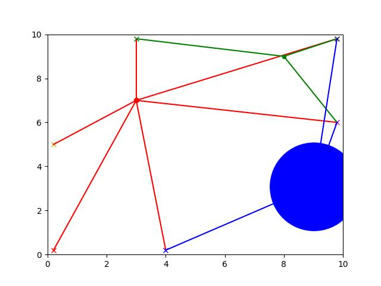
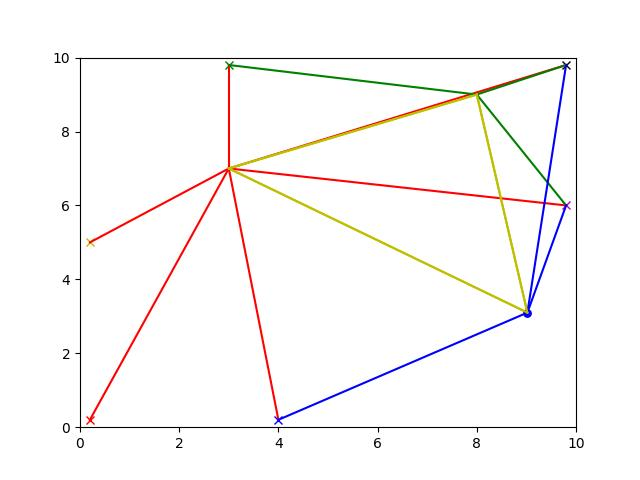

# CoLoNet: Collaborative Localization in Wireless Sensor Networks


CoLoNet simulates how mobile wireless sensors can localize themselves more accurately by talking to each other. Using geometric uncertainty models and neighbor-based trilateration, it shows how inter-tag links can reduce localization error—especially when fixed anchors are few and far between.

## Project Structure

```
colonet/
├── assets/
├── results/
├── main.py                    # Core simulation and visualization
├── report.pdf                 # Technical documentation
├── presentation.pdf           # Presentation slides
├── README.md
├── LICENSE
└── .gitignore
```

## Features

- Mobile + fixed sensor modeling with configurable sensing radii
- Real-time uncertainty visualization using `matplotlib`
- Neighbor-based updates with optional tag-to-tag communication
- Custom coordinate and sensor classes with basic physics support
- Simulation toggle for enabling/disabling tag links

## Getting Started

### Dependencies

This project requires Python 3.9+ and the following packages:

```bash
pip install numpy matplotlib pillow imageio[ffmpeg]
```

### Run the Simulation

```bash
python main.py
```

This will launch a fullscreen live simulation showing:
- Fixed anchors (colored ×)
- Mobile tags (colored circles)
- Dynamic links (anchor–tag, tag–tag)
- Marker size ∝ uncertainty

## Output Snapshots

| Without Tag Links | With Tag Links |
|-------------------|----------------|
|  |  |

> The presence of inter-tag communication prevents uncertainty divergence over time.

## Sample Output Video

Each simulation produces a `sim.mp4` video showing localization evolution over time.

| Mode              | Example Video           |
|-------------------|-------------------------|
| No Tag Comm       | `results/notagcomm/sim.mp4` |
| With Tag Comm     | `results/tagcomm/sim.mp4`   |

## Configuration

Edit the following parameters directly in `main.py`:

```python
tagcomm        = True    # Enable/disable tag-to-tag communication
final_time     = 10      # Total simulation time in seconds
sensing_radius =  7      # Sensor range in meters
timestep       =  0.1    # Timestep in seconds
```

## Applications

- Wildlife localization and monitoring
- Ad hoc sensor networks in urban environments
- Low-power distributed positioning systems
- Indoor GPS-denied navigation

## Project Context

> Developed as part of the course project for *EE 617: Sensors in Instrumentation* at **IIT Bombay**.

**Author:**  
Aaron John Sabu  
Department of Electrical Engineering  
Indian Institute of Technology Bombay  

## License

MIT License © 2020  
Indian Institute of Technology Bombay